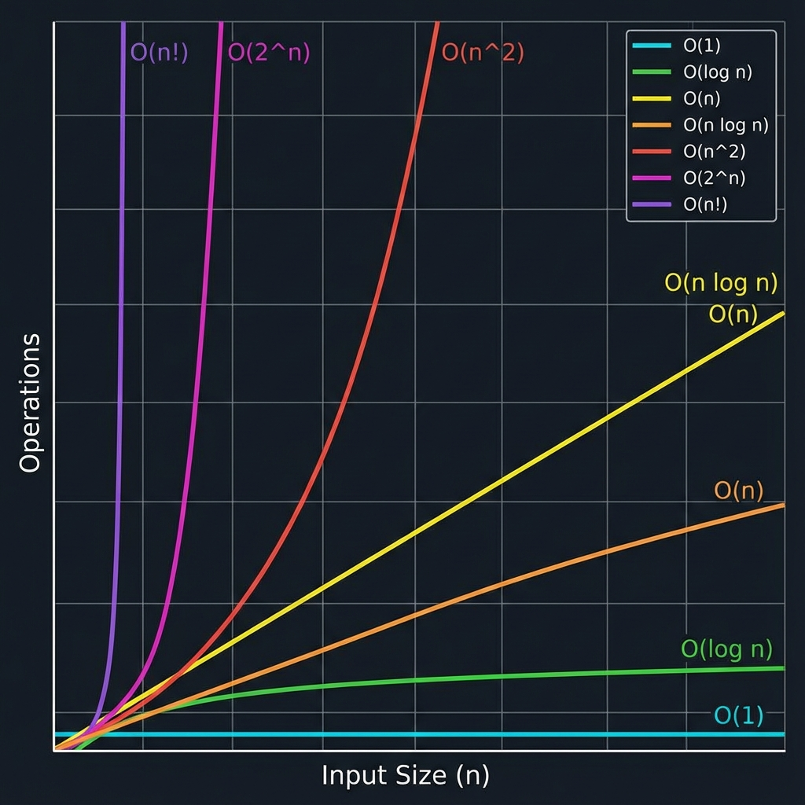

# Big O Notation

Big O notation is the language we use to describe the efficiency of an algorithm. It describes how the runtime or space requirements grow as the input size ($N$) grows.

## Time Complexity



| Notation      | Name         | Description                                             | Example                      |
| :------------ | :----------- | :------------------------------------------------------ | :--------------------------- |
| $O(1)$        | Constant     | Runtime does not change with input size.                | Accessing an array index.    |
| $O(\log N)$   | Logarithmic  | Runtime grows logarithmically. Common in binary search. | Binary Search.               |
| $O(N)$        | Linear       | Runtime grows linearly with input size.                 | Looping through an array.    |
| $O(N \log N)$ | Linearithmic | Common in efficient sorting algorithms.                 | Merge Sort, Quick Sort.      |
| $O(N^2)$      | Quadratic    | Runtime grows with the square of input size.            | Nested loops (Bubble Sort).  |
| $O(2^N)$      | Exponential  | Runtime doubles with each additional input.             | Recursive Fibonacci (naive). |
| $O(N!)$       | Factorial    | Runtime grows factorially.                              | Permutations of a string.    |

### Constant Time $O(1)$

The algorithm takes the same amount of time regardless of the input size.

```go
func getItem(arr []int, index int) int {
    return arr[index] // Always one operation
}
```

### Logarithmic Time $O(\log N)$

The number of operations is reduced by a fraction (usually halved) in each step.

```go
func binarySearch(arr []int, target int) int {
    low, high := 0, len(arr)-1
    for low <= high {
        mid := low + (high-low)/2
        if arr[mid] == target {
            return mid
        } else if arr[mid] < target {
            low = mid + 1
        } else {
            high = mid - 1
        }
    }
    return -1
}
```

### Linear Time $O(N)$

The runtime grows directly in proportion to the input size.

```go
func printAll(arr []int) {
    for _, val := range arr {
        fmt.Println(val)
    }
}
```

### Linearithmic Time $O(N \log N)$

Common in efficient sorting algorithms like Mergesort and Heapsort.

```go
// Merge Sort (simplified conceptual structure)
func mergeSort(arr []int) []int {
    if len(arr) <= 1 {
        return arr
    }
    mid := len(arr) / 2
    left := mergeSort(arr[:mid])
    right := mergeSort(arr[mid:])
    return merge(left, right) // merge takes O(N), called O(log N) times depth
}
```

### Quadratic Time $O(N^2)$

The runtime is proportional to the square of the input size. Common with nested loops.

```go
func printPairs(arr []int) {
    for i := 0; i < len(arr); i++ {
        for j := 0; j < len(arr); j++ {
            fmt.Println(arr[i], arr[j])
        }
    }
}
```

### Exponential Time $O(2^N)$

The runtime doubles with each addition to the input data set. Often seen in recursive algorithms solving problems of size N-1.

```go
func fibonacci(n int) int {
    if n <= 1 {
        return n
    }
    return fibonacci(n-1) + fibonacci(n-2)
}
```

### Factorial Time $O(N!)$

The runtime grows factorially. This is extremely slow and usually only viable for very small N.

```go
func permutations(str string) {
    runes := []rune(str)
    var generate func(int)
    generate = func(k int) {
        if k == len(runes) {
            fmt.Println(string(runes))
            return
        }
        for i := k; i < len(runes); i++ {
            runes[k], runes[i] = runes[i], runes[k]
            generate(k + 1)
            runes[k], runes[i] = runes[i], runes[k] // backtrack
        }
    }
    generate(0)
}
```

## Space Complexity

Space complexity measures the total amount of memory space used by an algorithm, including the space of input values for execution.

- **Fixed Part**: Constants, simple variables, fixed-size variables.
- **Variable Part**: Dynamic memory allocation, recursion stack space.

### Examples

**$O(1)$ Space**:

```go
func sum(n int) int {
    total := 0 // One variable
    for i := 0; i < n; i++ {
        total += i
    }
    return total
}
```

**$O(N)$ Space**:

```go
func copyArray(arr []int) []int {
    newArr := make([]int, len(arr)) // Allocates O(N) space
    copy(newArr, arr)
    return newArr
}
```

## Key Concepts for Interviews

1.  **Drop Constants**: Big O describes the _rate of growth_. $O(2N)$ describes the same growth curve as $O(N)$.

    - $O(2N) \rightarrow O(N)$
    - $O(500) \rightarrow O(1)$

2.  **Drop Non-Dominant Terms**: As $N$ gets very large, lower-order terms become insignificant.

    - $O(N^2 + N) \rightarrow O(N^2)$
    - $O(N + \log N) \rightarrow O(N)$

3.  **Multi-Part Algorithms**:

    - **Add** runtimes if steps happen sequentially: $O(A + B)$.
      ```go
      for _, a := range arrA { ... } // O(A)
      for _, b := range arrB { ... } // O(B)
      // Total: O(A + B)
      ```
    - **Multiply** runtimes if steps are nested: $O(A * B)$.
      ```go
      for _, a := range arrA {
          for _, b := range arrB { ... } // O(B)
      }
      // Total: O(A * B)
      ```

4.  **Amortized Time**:

    - Some operations are slow occasionally but fast most of the time.
    - Example: Appending to a dynamic array (slice in Go). Usually $O(1)$, but when capacity is reached, it reallocates and copies, taking $O(N)$.
    - Averaged over many operations, it is **Amortized $O(1)$**.

5.  **Log N Runtime**:
    - Whenever an algorithm cuts the problem size in half at each step (like Binary Search), it likely has an $O(\log N)$ runtime.
