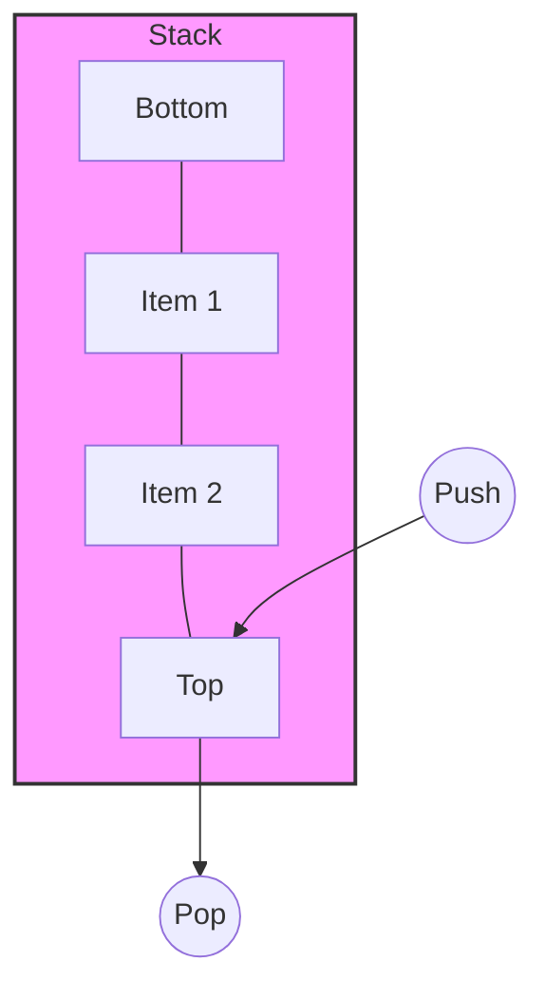

# Stacks



A stack is a **LIFO** (Last-In, First-Out) data structure. Think of it like a stack of dinner plates; you add to the top and remove from the top.

## Key Operations

- **Push**: Add an item to the top. $O(1)$.
- **Pop**: Remove the top item. $O(1)$.
- **Peek**: Return the top item without removing it. $O(1)$.
- **IsEmpty**: Return true if the stack is empty. $O(1)$.

## Uses

- Recursive algorithms (call stack)
- Backtracking (maze solving)
- Undo mechanisms in editors
- Syntax parsing (matching parentheses)

## Go Implementation

In Go, stacks are commonly implemented using slices. A struct can be used to encapsulate the operations.

```go
package main

import "fmt"

// Stack represents a stack of integers
type Stack struct {
    items []int
}

// Push adds an item to the top of the stack
func (s *Stack) Push(item int) {
    s.items = append(s.items, item)
}

// Pop removes and returns the top item
// Returns -1 and false if the stack is empty (for simplicity)
func (s *Stack) Pop() (int, bool) {
    if s.IsEmpty() {
        return -1, false
    }
    index := len(s.items) - 1
    item := s.items[index]
    s.items = s.items[:index]
    return item, true
}

// Peek returns the top item without removing it
func (s *Stack) Peek() (int, bool) {
    if s.IsEmpty() {
        return -1, false
    }
    return s.items[len(s.items)-1], true
}

// IsEmpty returns true if the stack is empty
func (s *Stack) IsEmpty() bool {
    return len(s.items) == 0
}

func main() {
    s := &Stack{}
    s.Push(10)
    s.Push(20)

    val, _ := s.Peek()
    fmt.Println("Top:", val) // Top: 20

    val, _ = s.Pop()
    fmt.Println("Popped:", val) // Popped: 20
}
```
