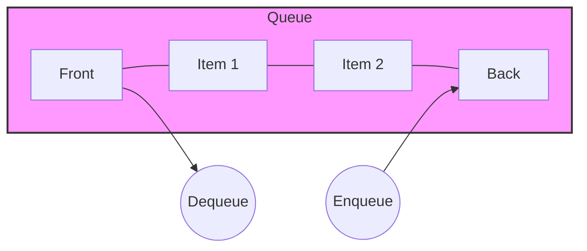

# Queues



A queue is a **FIFO** (First-In, First-Out) data structure. Think of it like a line of people waiting for a movie ticket; the first person in line is the first one served.

## Key Operations

- **Add (Enqueue)**: Add an item to the end. $O(1)$.
- **Remove (Dequeue)**: Remove the first item. $O(1)$.
- **Peek**: Return the top item. $O(1)$.
- **IsEmpty**: Return true if the queue is empty. $O(1)$.

## Uses

- Breadth-First Search (BFS)
- Print queues
- Processing tasks in order (job queues)
- Web server request handling

## Go Implementation

Go slices can be used for queues, but removing from the front (`slice[1:]`) causes a shift of all remaining elements, making it $O(N)$. For a true $O(1)$ dequeue, a Linked List or a circular buffer is preferred.

### Slice Implementation (Simple)

```go
queue := []int{}
queue = append(queue, 1) // Enqueue
val := queue[0]          // Peek
queue = queue[1:]        // Dequeue (O(N) shift)
```

### Linked List Implementation (Efficient)

Using a linked list allows for $O(1)$ enqueue and dequeue.

```go
package main

import "fmt"

type Node struct {
    Value int
    Next  *Node
}

type Queue struct {
    First *Node
    Last  *Node
    Size  int
}

// Enqueue adds an item to the end
func (q *Queue) Enqueue(item int) {
    newNode := &Node{Value: item}
    if q.Last != nil {
        q.Last.Next = newNode
    }
    q.Last = newNode
    if q.First == nil {
        q.First = newNode
    }
    q.Size++
}

// Dequeue removes the first item
func (q *Queue) Dequeue() (int, bool) {
    if q.First == nil {
        return -1, false
    }
    item := q.First.Value
    q.First = q.First.Next
    if q.First == nil {
        q.Last = nil
    }
    q.Size--
    return item, true
}

// Peek returns the first item
func (q *Queue) Peek() (int, bool) {
    if q.First == nil {
        return -1, false
    }
    return q.First.Value, true
}

// IsEmpty returns true if the queue is empty
func (q *Queue) IsEmpty() bool {
    return q.First == nil
}

func main() {
    q := &Queue{}
    q.Enqueue(1)
    q.Enqueue(2)

    val, _ := q.Peek()
    fmt.Println("First:", val) // First: 1

    val, _ = q.Dequeue()
    fmt.Println("Dequeued:", val) // Dequeued: 1
}
```
