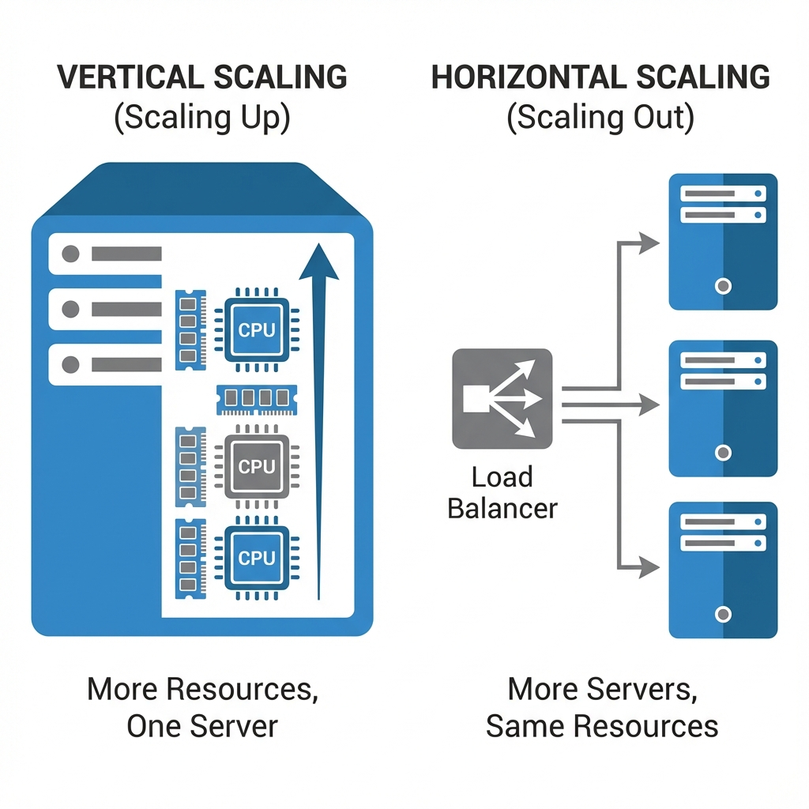

# Scalability: A Deep Dive

Scalability is the capability of a system, network, or process to handle a growing amount of work, or its potential to be enlarged to accommodate that growth. It is the defining characteristic of modern high-performance systems.

## 1. Vertical Scaling (Scaling Up)

Vertical scaling involves adding more resources (CPU, RAM, Disk, Network Bandwidth) to a single node.

### Deep Dive

- **Hardware Limits**: Even the most expensive mainframes have a ceiling (e.g., 128 cores, 4TB RAM). Once reached, you cannot scale further.
- **Cost Curve**: The cost of hardware does not scale linearly. A machine with 2x performance might cost 5x as much.
- **Use Cases**:
  - **Database Masters**: Often vertically scaled to handle write-heavy loads that are hard to shard.
  - **Legacy Apps**: Monolithic applications that cannot run on multiple instances.
  - **MVP Phase**: Easiest way to handle initial growth without engineering complexity.

### Pros & Cons

| Pros                                                       | Cons                                                         |
| :--------------------------------------------------------- | :----------------------------------------------------------- |
| **Simplicity**: No code changes required.                  | **Hard Limit**: Finite capacity.                             |
| **Data Consistency**: No distributed data problems.        | **SPOF**: Single Point of Failure.                           |
| **Latency**: Inter-process communication is fast (memory). | **Downtime**: Upgrading hardware usually requires a restart. |

## 2. Horizontal Scaling (Scaling Out)

Horizontal scaling involves adding more nodes (machines/containers) to a pool of resources.

### Deep Dive

- **Statelessness**: To scale horizontally effectively, application servers should be stateless. They should not store user sessions locally; instead, use an external store like Redis.
- **Distributed Computing**: Introduces challenges like network partitions, data synchronization, and distributed transactions.
- **Commodity Hardware**: You can use cheaper, standard machines. Cloud providers (AWS, GCP) make this trivial with Auto Scaling Groups.

### Pros & Cons

| Pros                                                         | Cons                                                                 |
| :----------------------------------------------------------- | :------------------------------------------------------------------- |
| **Infinite Scale**: Theoretically unlimited.                 | **Complexity**: Requires Load Balancers, Service Discovery.          |
| **Resilience**: Failure of one node doesn't kill the system. | **Data Consistency**: Harder to maintain (CAP Theorem).              |
| **Zero Downtime**: Rolling updates are possible.             | **Network Latency**: RPC calls are slower than local function calls. |

## 3. Bottleneck Analysis

Identifying _where_ to scale is as important as _how_.

### Common Bottlenecks

1.  **CPU Bound**: Heavy computation (Video encoding, Encryption, ML inference).
    - _Fix_: Add more cores, optimize algorithms, offload to GPU.
2.  **Memory Bound**: Large working sets (Cache, In-memory DBs).
    - _Fix_: Add RAM, optimize data structures, fix memory leaks.
3.  **I/O Bound (Disk)**: Database writes, logging, file processing.
    - _Fix_: SSDs, RAID, Sharding, Batching writes.
4.  **Network Bound**: High bandwidth usage (Video streaming) or connection limits (WebSockets).
    - _Fix_: 10Gbps+ NICs, CDNs, Compression.

### Tools for Analysis

- `top`, `htop`, `vmstat`, `iostat` (Linux basics).
- **APM** (Application Performance Monitoring): Datadog, New Relic, DynaTrace.
- **Profiling**: pprof (Go), JProfiler (Java).

## 4. Elasticity vs Scalability

- **Scalability**: Ability to handle more load (capacity).
- **Elasticity**: Ability to scale _up and down_ automatically based on demand (cost efficiency). Cloud computing enables elasticity.

## Bibliography & Further Reading

1.  **"Designing Data-Intensive Applications"** by Martin Kleppmann - _Chapter 1: Reliable, Scalable, and Maintainable Applications_.
2.  **"System Design Interview"** by Alex Xu - _Chapter 1: Scale From Zero to Millions of Users_.
3.  **AWS Whitepaper**: _Architecting for the Cloud: Best Practices_.
4.  **Google SRE Book**: _Chapter 20: Load Balancing at the Datacenter_.
