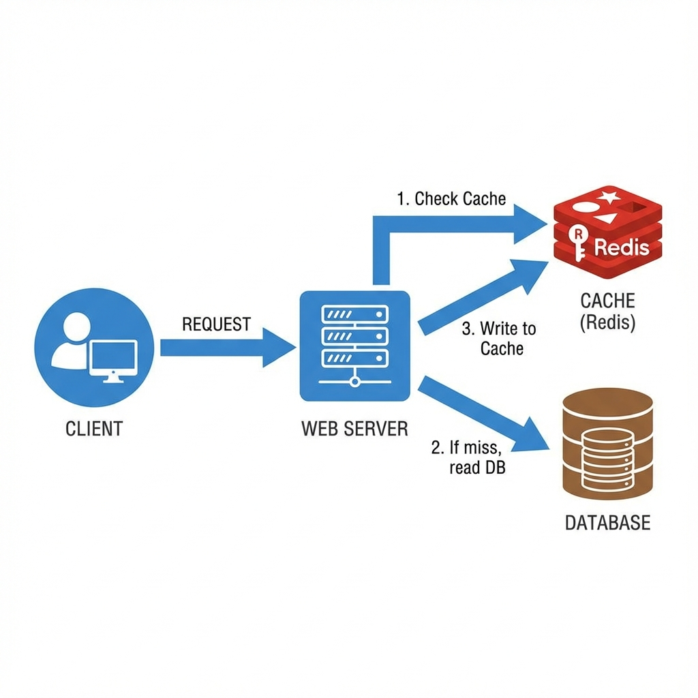

# Caching: A Deep Dive

Caching is the technique of storing copies of frequently accessed data in a temporary storage location (faster memory) to reduce access latency and load on the primary storage (database/disk). It is the single most effective way to improve performance.

## 1. Caching Layers

Caching can be applied at every layer of the stack:

1.  **Client (Browser)**: HTTP caching (Headers: `Cache-Control`, `ETag`). Saves network bandwidth.
2.  **CDN (Edge)**: Caches static assets (images, video, CSS) geographically closer to the user.
3.  **Load Balancer / Reverse Proxy**: Varnish/Nginx can cache entire HTML pages.
4.  **Application**: In-memory objects (local heap). Fast but not shared across servers.
5.  **Distributed Cache**: Redis/Memcached. Shared across all app servers.
6.  **Database**: Internal buffer pool, query cache.

## 2. Caching Patterns

### Cache-Aside (Lazy Loading)

The application is responsible for reading and writing from the cache.

1.  App checks Cache.
2.  If **Hit**, return data.
3.  If **Miss**, read DB, write to Cache, return data.

- **Pros**: Only requested data is cached. Resilient to cache failure.
- **Cons**: First request is always slow (Cache Miss). Data can become stale.

### Read-Through

The application treats the cache as the main data store. The cache is responsible for fetching from the DB on a miss.

- **Pros**: Simplifies app code.
- **Cons**: Cache must know how to fetch data (plugin/connector required).

### Write-Through

Data is written to the Cache and the DB synchronously.

- **Pros**: High consistency. Data in cache is never stale.
- **Cons**: Higher write latency (two writes).

### Write-Back (Write-Behind)

Data is written only to the Cache. The Cache writes to the DB asynchronously (later).

- **Pros**: Extremely fast writes. Good for write-heavy workloads (counters, analytics).
- **Cons**: **Data Loss Risk**. If the cache crashes before syncing to DB, data is lost.

## 3. Eviction Policies

When the cache is full, something must go.

- **LRU (Least Recently Used)**: The gold standard. Discards the item that hasn't been used for the longest time. Good for recency bias.
- **LFU (Least Frequently Used)**: Discards items with the lowest access count. Good for stable access patterns.
- **FIFO**: First In First Out. Simple but inefficient (can evict popular data).
- **TTL (Time To Live)**: Not strictly an eviction policy based on space, but on time. Keys expire after $X$ seconds. Essential for eventual consistency.

## 4. The Thundering Herd (Cache Stampede)

When a popular key expires, thousands of concurrent requests might get a "Cache Miss" at the same exact millisecond. All of them hit the Database simultaneously, potentially crashing it.

- **Solution 1: Locking**: Only the first process gets a lock to recompute the value. Others wait.
- **Solution 2: Probabilistic Early Expiration**: If TTL is 60s, start recomputing it at 55s with a small probability.

## 5. Cache Consistency

Keeping Cache and DB in sync is one of the hardest problems in CS.

- **Invalidation**: When updating DB, delete the cache key. Next read will re-fetch. Preferred over updating cache (race conditions).
- **Double Delete**: Delete cache, update DB, wait (sleep), delete cache again. (Solves some race conditions).

## Bibliography & Further Reading

1.  **"Designing Data-Intensive Applications"** - _Chapter 3: Storage and Retrieval_.
2.  **Redis Documentation**: _Client-side caching and Pipelining_.
3.  **Facebook Engineering Blog**: _Scaling Memcache at Facebook_.
4.  **Amazon Builders' Library**: _Caching challenges and strategies_.
