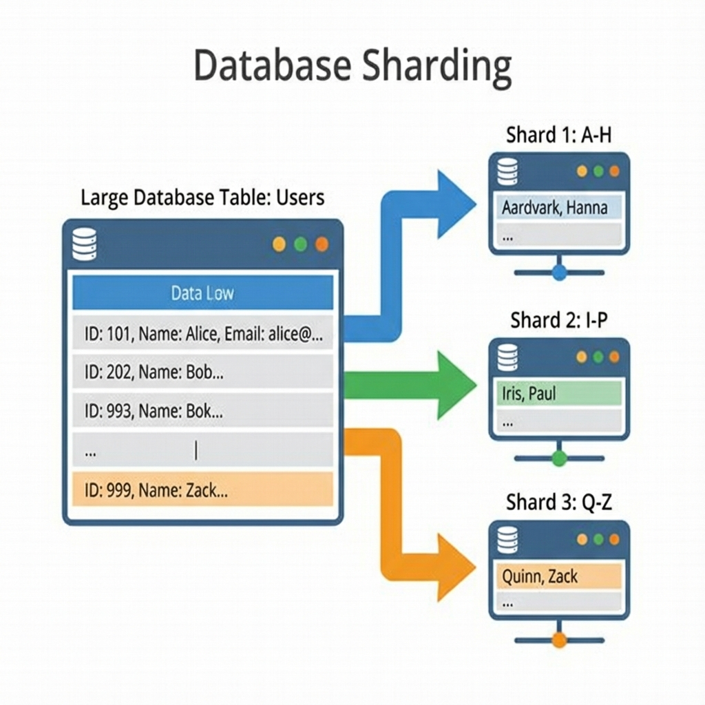

# Sharding and Replication: A Deep Dive

Scaling a database is often the most challenging part of system design. We use Replication for read scaling and availability, and Sharding for write scaling and storage capacity.

## 1. Replication

Replication creates copies of the database on multiple machines.

### Topologies

- **Master-Slave (Active-Passive)**:
  - **Master**: Handles all Writes. Replicates logs to Slaves.
  - **Slaves**: Handle Reads. Read-only copies.
  - **Pros**: Simple, strict consistency on Master.
  - **Cons**: Master is a write bottleneck. Failover takes time.
- **Master-Master (Active-Active)**:
  - Multiple nodes handle Writes.
  - **Pros**: High write availability.
  - **Cons**: **Conflict Resolution** (what if two users update the same row on different masters?). Complex to maintain.

### Replication Methods

- **Synchronous**: Master waits for Slave to confirm write.
  - _Pros_: Zero data loss.
  - _Cons_: High latency. If Slave is down, Write fails.
- **Asynchronous**: Master returns immediately. Replicates in background.
  - _Pros_: Fast.
  - _Cons_: **Replication Lag**. Potential data loss on Master failure.

## 2. Sharding (Partitioning)

Sharding splits a large dataset into smaller chunks (shards) across multiple servers. It is a form of "Shared-Nothing" architecture.

### Partitioning Strategies

1.  **Range Based**: `UserID 1-1000` -> Shard A. `UserID 1001-2000` -> Shard B.
    - _Pros_: Easy to implement range queries.
    - _Cons_: **Hotspots**. If UserIDs are sequential, all new users hit the last shard.
2.  **Hash Based**: `Shard = hash(UserID) % N`.
    - _Pros_: Uniform distribution. No hotspots.
    - _Cons_: **Resharding**. If you change $N$, almost all keys move.
3.  **Consistent Hashing**: A ring topology. Adding/removing a node only affects $1/N$ keys. Used by Cassandra, DynamoDB.

### Challenges of Sharding

- **Joins**: You cannot join tables across different shards. You must do it in the application code (fetch from A, fetch from B, combine).
- **Transactions**: ACID is local to a shard. Distributed transactions (Two-Phase Commit / 2PC) are slow and complex.
- **Unique IDs**: You can't use auto-incrementing IDs easily. Use **Snowflake** (Twitter) or UUIDs.

## 3. The "Hot Key" Problem (Celebrity Problem)

Even with perfect sharding, one key (e.g., Justin Bieber's tweets) might get 1000x more traffic.

- **Solution**: Isolate the hot key. Add a random suffix to the key to spread writes across replicas. Aggressively cache reads.

## Bibliography & Further Reading

1.  **"Designing Data-Intensive Applications"** - _Chapter 5: Replication_ and _Chapter 6: Partitioning_.
2.  **Dynamo Paper (Amazon)**: The foundational paper on consistent hashing and high availability.
3.  **Google Spanner Paper**: TrueTime and global consistency.
4.  **MongoDB Documentation**: _Sharding and Replication_.
