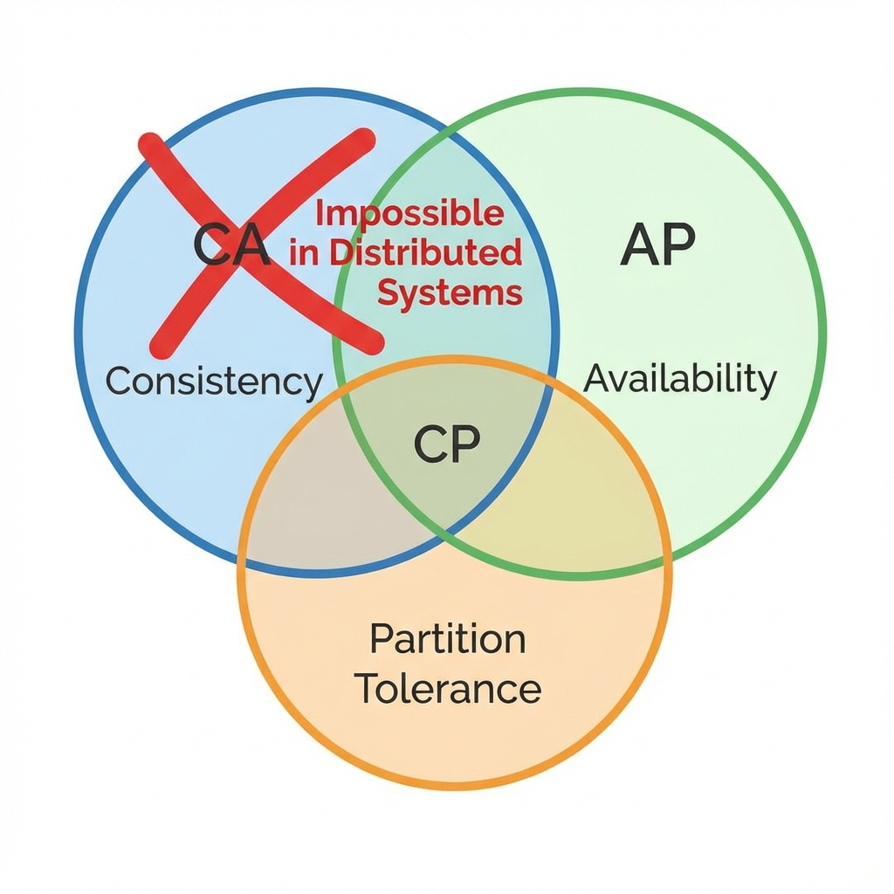

# CAP Theorem: A Deep Dive

The CAP Theorem (Brewer's Theorem) is a fundamental principle in distributed systems. It proves that it is impossible for a distributed data store to simultaneously provide more than two out of the following three guarantees.

## 1. The Three Pillars

1.  **Consistency (C)**: Linearizability. Every read receives the most recent write or an error. It looks like a single machine to the user.
2.  **Availability (A)**: Every request receives a (non-error) response, without the guarantee that it contains the most recent write. The system must stay up.
3.  **Partition Tolerance (P)**: The system continues to operate despite an arbitrary number of messages being dropped or delayed by the network between nodes.

## 2. The "Pick Two" Fallacy

You cannot simply "pick two". In a distributed system over a wide-area network (WAN), **partitions are inevitable**. Network cables get cut, switches fail.

- Therefore, **P is mandatory**.
- The real choice is: **When a partition happens, do you choose C or A?**

### CP (Consistency over Availability)

"I would rather return an Error than return wrong data."

- **Behavior**: If the Master cannot contact the Slave, it stops accepting writes to prevent divergence.
- **Examples**: Banking systems, HBase, MongoDB (default), Redis (Sentinel/Cluster can be configured).

### AP (Availability over Consistency)

"I would rather return slightly old data than return an Error."

- **Behavior**: Nodes accept writes even if they can't talk to each other. They will sync up later (Eventual Consistency).
- **Examples**: Social Media feeds, Cassandra, DynamoDB, CouchDB.

## 3. Consistency Models

Consistency is not binary. There is a spectrum.

- **Strong Consistency**: See CAP "C".
- **Weak Consistency**: No guarantee when data will update.
- **Eventual Consistency**: If no new updates are made, eventually all accesses return the last updated value. (DNS is a classic example).
- **Causal Consistency**: Writes that are causally related must be seen in order. Unrelated writes can be seen in any order.

## 4. PACELC Theorem

CAP is too simplistic because it only discusses failure modes (Partitions). What about when the system is running normally?
**PACELC** states:

- If **P**artition: Choose **A** or **C**.
- **E**lse (Normal): Choose **L**atency or **C**onsistency.

- **Explanation**: Even without a partition, keeping data perfectly consistent requires replication, which takes time (Latency). If you want low Latency, you must relax Consistency.
- **Example**: DynamoDB allows you to choose between "Strongly Consistent Reads" (Higher Latency/Cost) and "Eventually Consistent Reads" (Lower Latency).

## Bibliography & Further Reading

1.  **"Brewer's Conjecture and the Feasibility of Consistent, Available, Partition-Tolerant Web Services"** (Seth Gilbert and Nancy Lynch) - _The formal proof_.
2.  **"Designing Data-Intensive Applications"** - _Chapter 9: Consistency and Consensus_.
3.  **"Dynamo: Amazon’s Highly Available Key-value Store"** - _Real-world application of AP_.
4.  **Daniel Abadi's Blog**: _Problems with CAP, and Yahoo's little known NoSQL system (PACELC)_.
