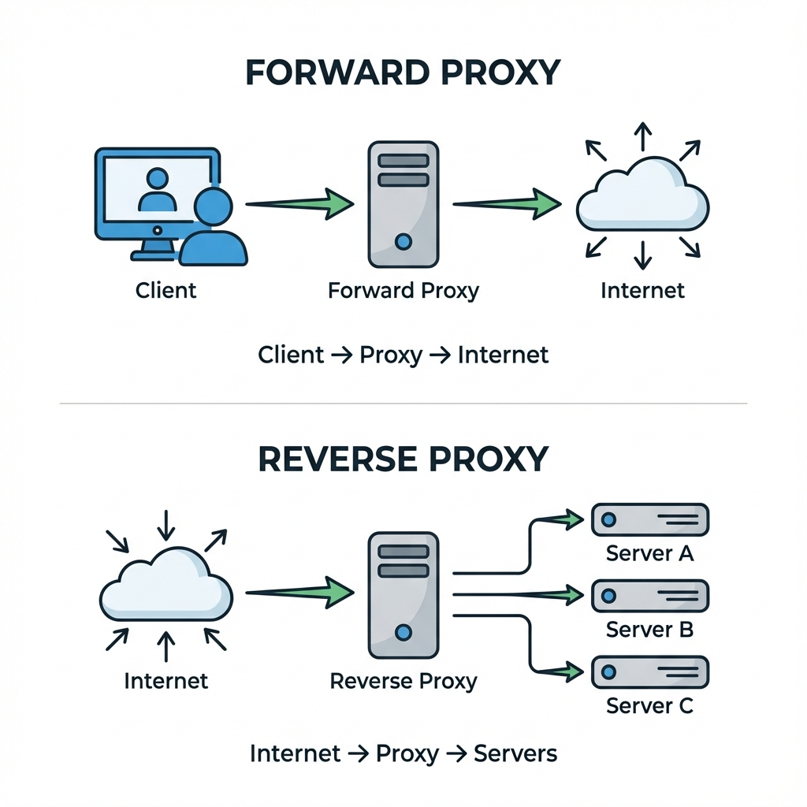

# Proxies: A Deep Dive

A proxy server is a gateway application that acts as an intermediary between a client requesting a resource and the server providing that resource.

## 1. Forward Proxy

A Forward Proxy sits in front of the **Client**. To the internet, the traffic looks like it is coming from the Proxy, not the Client.

### Use Cases

- **Anonymity / Privacy**: VPNs are essentially forward proxies. They hide your IP address.
- **Content Filtering**: Corporate/School networks use proxies to block access to NSFW sites or social media (e.g., Squid Proxy).
- **Bypassing Geo-Restrictions**: Accessing content available only in certain countries.
- **Caching**: ISPs use forward proxies to cache common sites to save bandwidth.

## 2. Reverse Proxy

A Reverse Proxy sits in front of the **Web Servers**. To the client, it looks like they are talking directly to the origin server.

### Use Cases

- **Load Balancing**: Distributing requests across a cluster of servers.
- **Security**:
  - **DDoS Protection**: The proxy absorbs the attack. The backend IP is hidden.
  - **WAF**: Filters SQL injection and XSS attacks.
- **SSL Termination (Offloading)**: Decrypting HTTPS requests is CPU intensive. The Proxy handles this, sending plain HTTP to the backend (inside the secure VPC).
- **Caching**: Serving static content (images, CSS) directly without hitting the app server.
- **Compression**: Gzipping responses to save bandwidth.

## 3. The Sidecar Proxy (Service Mesh)

In Microservices (Kubernetes), a new pattern has emerged: the Sidecar.

- A tiny proxy (e.g., Envoy, Linkerd) runs alongside _every_ single application container.
- It handles all network traffic (mTLS, retries, circuit breaking, observability).
- This forms a **Service Mesh** (e.g., Istio).

## 4. Popular Proxy Software

- **Nginx**: The most popular web server and reverse proxy. High performance, event-driven.
- **HAProxy**: Pure TCP/HTTP load balancer. Extremely stable and fast. Used by high-traffic sites (Airbnb, GitHub).
- **Envoy**: Designed for cloud-native microservices.
- **Squid**: Classic forward proxy for caching and filtering.

## Bibliography & Further Reading

1.  **Nginx Documentation**: _Reverse Proxy Guide_.
2.  **"Site Reliability Engineering"** - _Chapter 19: Load Balancing_.
3.  **Istio Documentation**: _What is a Service Mesh?_
4.  **Cloudflare Learning Center**: _What is a Reverse Proxy?_
